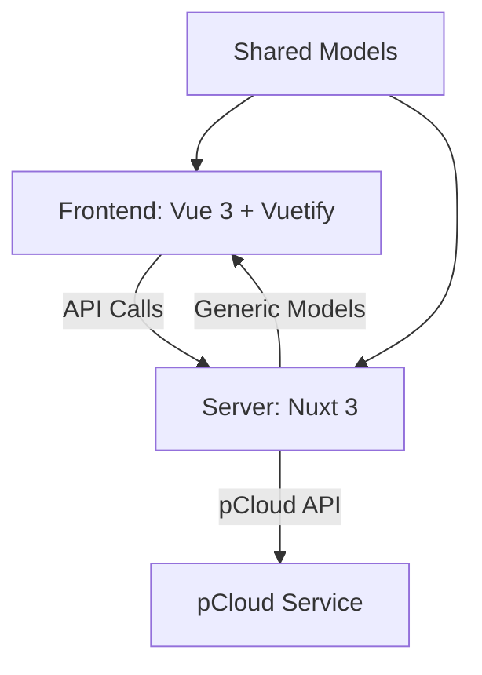
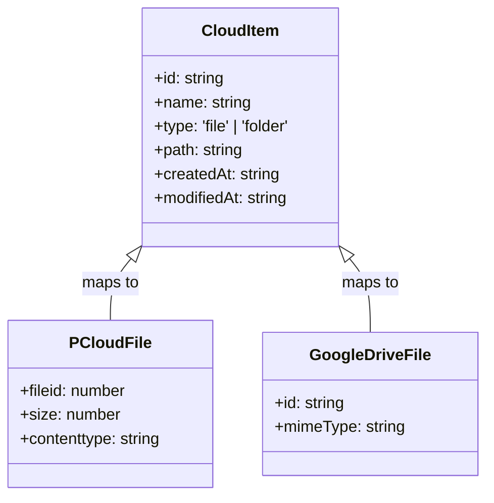

# pCloud Browser

A modern pCloud browser built with Nuxt 3 and Vuetify. Currently integrated with pCloud with architecture designed for easy addition of other cloud providers.

## 🚀 Features

### Core Functionality
- ✅ **File Browsing**: Navigate pCloud file structure
- ✅ **File Uploads**: Upload files with progress tracking
- ✅ **Folder Management**: Create, rename, delete folders
- ✅ **Provider-Agnostic**: Designed for multiple cloud providers
- ✅ **Responsive UI**: Works on desktop and mobile

### Technical Highlights
- **Nuxt 3** with server-side rendering
- **Vuetify** for UI components
- **TypeScript** for type safety
- **Provider-agnostic architecture** for easy extension
- **Clean composable-based architecture**

## 📋 Architecture


n
### Key Components

- **Frontend**: Vue 3 composition API, Vuetify components
- **Backend**: Nuxt 3 server endpoints, provider integration
- **Shared**: Provider-agnostic models and utilities
- **Mappers**: Convert provider-specific → generic models

## 🛠 Setup

### Prerequisites
- Node.js 14+
- pnpm 10+
- pCloud account

### Installation

```bash
# Install dependencies
pnpm install

# Copy environment file
cp .env.example .env

# Edit .env with your pCloud credentials:
APP_CLIENT_ID=your_client_id
APP_CLIENT_SECRET=your_client_secret
```

## 🚀 Development

### Start Development Server

```bash
pnpm run dev
```

Server runs at: `http://localhost:3000`

### Key Scripts

```bash
pnpm run dev      # Development server
pnpm run build    # Production build
pnpm run preview   # Preview production build
pnpm run lint     # Run ESLint
pnpm run lint:fix # Fix ESLint issues
```

## 📦 Project Structure

```bash
.
├── app/               # Frontend components and pages
├── server/            # Backend API endpoints
├── shared/            # Provider-agnostic models and utilities
├── docs/              # Documentation
├── public/            # Static assets
└── ...
```

### Key Files

- `app/components/AppFileExplorer.vue` - Main file browser
- `app/components/AppFileUpload.vue` - File upload component
- `server/api/pcloud/` - pCloud API integration
- `shared/models/cloud-item.ts` - Provider-agnostic models
- `server/mappers/pcloud-mapper.ts` - pCloud → CloudItem mapping

## 🔧 Configuration

### Environment Variables

```env
# .env file
APP_CLIENT_ID=your_pcloud_client_id
APP_CLIENT_SECRET=your_pcloud_client_secret
```

### Runtime Config

Configure in `nuxt.config.ts`:
- API endpoints
- Authentication settings
- Feature flags

## 📖 Usage

### File Upload

```vue
<AppFileUpload @files-uploaded="handleUploadComplete" />
```

### File Listing

```vue
<script setup>
const { useListFolder } = useFolder()
const { data, refresh } = useListFolder('0') // Root folder

// Access files and folders
const files = computed(() => data.value?.entries.filter(item => item.type === 'file'))
</script>
```

## 🧩 Extending to Other Providers

### Architecture



### Adding a New Provider

1. **Create Provider Models**: Define provider-specific types
2. **Add Mapper**: Create `provider-mapper.ts` for conversion
3. **Add API Endpoints**: Implement provider-specific endpoints
4. **Update Frontend**: Add provider selection (if needed)

Example mapper structure:
```typescript
// server/mappers/google-drive-mapper.ts
export function mapGoogleDriveToCloudItem(item: GoogleDriveFile): CloudFile {
  return {
    id: item.id,
    name: item.name,
    type: 'file',
    // ... other mappings
  }
}
```

## 🔍 Technical Details

### Provider-Agnostic Design

The application uses an **adapter pattern** to abstract cloud provider differences:

```typescript
// Shared model (frontend uses this)
interface CloudItem {
  id: string
  name: string
  type: 'file' | 'folder'
  // ... generic properties
}

// Provider-specific implementation
function mapPCloudToCloudItem(pcloudItem: PCloudFile): CloudItem {
  // Convert pCloud-specific format to generic
}
```

### Error Handling

Standardized error format:
```json
{
  "error": true,
  "statusCode": 400,
  "statusMessage": "Bad Request",
  "message": "Detailed error message"
}
```

## 🚀 Deployment

### Build for Production

```bash
pnpm run build
```

### Preview Production Build

```bash
pnpm run preview
```

## 📚 Resources

### Documentation

- [Nuxt 3 Documentation](https://nuxt.com/docs)
- [Vuetify Documentation](https://vuetifyjs.com/)
- [pCloud API Documentation](https://docs.pcloud.com/)

### Related Projects

- [Nuxt 3](https://github.com/nuxt/nuxt)
- [Vuetify](https://github.com/vuetifyjs/vuetify)
- [pCloud API](https://docs.pcloud.com/)

