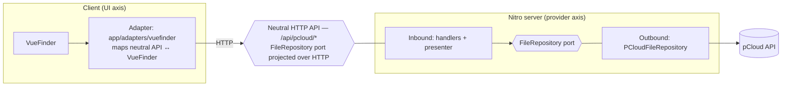

# pCloud Browser

A cloud file browser built with Nuxt 4 and Nuxt UI, using the [VueFinder](https://github.com/n1crack/vuefinder) file-manager UI. Currently wired to pCloud, with a hexagonal architecture designed so that both the cloud provider and the UI library can be swapped independently.

## Tech stack

- **Nuxt 4** (Vue 3, Nitro server engine)
- **Nuxt UI 4** + **Tailwind CSS 4** (app shell, theming)
- **VueFinder 4** (file-manager UI)
- **nuxt-auth-utils** (session, pCloud OAuth2)
- **@nuxthub/core** (deployment)
- **Zod** (request validation), **Luxon** (dates)
- **TypeScript**, **ESLint** (antfu config)

## Architecture

The design separates two independent axes of change behind a **neutral HTTP API** that knows about neither the cloud provider nor the UI library:

- **Swap the cloud provider** (pCloud, later others): isolated by a *server-side* outbound adapter implementing the `FileRepository` port.
- **Swap the UI library** (VueFinder, later others): isolated by a *client-side* adapter implementing that library's driver interface.



Key properties:

- **Path-based addressing.** The domain port and neutral API speak absolute paths (`/Documents/file.txt`); the pCloud adapter is the only layer that bridges paths to pCloud's numeric ids.
- **Explicit serialization boundary.** The server presenter maps domain entities (with `Date` objects) to DTOs with ISO-8601 strings; the client adapter maps DTOs to VueFinder's shapes (e.g. `last_modified` epoch-ms, `storage://path` paths).
- **No duplicated layers.** The browser talks only to our neutral API; the pCloud access token never leaves the server.

### Neutral API

All endpoints live under `/api/{provider}` (currently `pcloud`) and mirror the `FileRepository` port:

| Method & path | Purpose |
|---|---|
| `GET /api/pcloud/list?path=` | List a directory and its children |
| `POST /api/pcloud/copy` | Copy items (`{ sources, destinationPath }`) |
| `POST /api/pcloud/move` | Move items |
| `POST /api/pcloud/delete` | Delete items (`{ paths }`) |
| `POST /api/pcloud/create-folder` | Create a folder (`{ parentPath, name }`) |
| `PATCH /api/pcloud/items` | Rename (`{ path, newName }`) |
| `GET /api/pcloud/search` | Search |
| `GET /api/pcloud/content?path=` | Read text content |
| `GET /api/pcloud/download?path=` | 302 redirect to a signed download URL |
| `GET /api/pcloud/preview?path=` | 302 redirect to a preview URL |

The handlers are provider-agnostic (`server/handlers/file-system.handlers.ts`); each is mounted via a thin literal route that re-exports it. A note on routing: a dynamic `[provider]` directory is intentionally **not** used, because the OAuth callback at `/api/pcloud/auth/callback` makes `pcloud` a static route node and Nitro won't fall back from it to a `[provider]` sibling.

## Setup

### Prerequisites

- Node.js 24+
- pnpm 11+
- A pCloud account and a registered pCloud OAuth2 app

### Installation

```bash
pnpm install
cp .env.example .env
# Fill in your pCloud OAuth2 credentials (see .env.example for the exact names).
# They populate runtimeConfig.appClientId / runtimeConfig.appClientSecret.
```

### Authentication flow

1. The user opens `/auth/pcloud`, which redirects to pCloud's OAuth2 authorize endpoint.
2. pCloud redirects back to `/api/pcloud/auth/callback`, which exchanges the code, fetches user info, and stores the session (via `nuxt-auth-utils`).
3. The client reads the session with `useUserSession()`; once `loggedIn`, VueFinder renders. The access token stays server-side and is read by the auth middleware on each `/api/*` request.

## Development

```bash
pnpm dev        # Dev server at http://localhost:3000
pnpm build      # Production build
pnpm generate   # Static generation
pnpm preview    # Preview the production build
pnpm lint       # ESLint
pnpm lint:fix   # ESLint with --fix
pnpm typecheck  # vue-tsc type checking
```

## Project structure

```bash
app/
├── adapters/vuefinder/   # Client UI adapter: driver, DTO↔VueFinder mapper, path translation
├── components/           # AppHeader (Nuxt UI shell)
├── composables/          # useVueFinderDriver
├── pages/index.vue       # Mounts <VueFinder> once logged in
└── plugins/              # Registers the VueFinder component (client-only)

server/
├── api/pcloud/           # Neutral endpoints (+ auth/callback, files/upload*)
├── adapters/pcloud/      # PCloudFileRepository (outbound) + low-level PCloudClient
├── handlers/             # Shared, provider-agnostic request handlers
├── presenters/           # Domain entity → DTO
├── utils/                # Provider resolver, HTTP error mapping
├── models/ constants/    # pCloud API response types and endpoints
├── middleware/           # Auth + request logging
└── routes/auth/          # OAuth2 entrypoint

shared/
├── contracts/            # Neutral API DTOs (the wire contract)
├── domain/               # Provider-agnostic entities + FileRepository port
└── types/                # VueFinder + auth types
```

### Adding a cloud provider

1. Implement `FileRepository` in `server/adapters/<provider>/`, bridging the path-based port to the provider's API.
2. Register it in `server/utils/repository.resolver.ts`.
3. Add literal routes under `server/api/<provider>/` that re-export the shared handlers.

The client and the neutral contract stay untouched.

### Swapping the UI library

Replace `app/adapters/<library>/` with an adapter implementing the new library's driver interface in terms of the neutral API. The server stays untouched.

## Status & limitations

- File browsing, copy, move, delete, rename, create-folder, search, download and preview are implemented end-to-end.
- **Upload is not yet wired.** pCloud's chunked/resumable and direct-upload-link APIs are unavailable under OAuth2, leaving only the single-shot `uploadfile` method, so upload size is bounded by the deployment platform's request limit. (Switching to pCloud's password/digest auth would unlock chunked upload but has no 2FA support, so OAuth2 is retained.)
- VueFinder ships a global, unlayered CSS bundle that can override Nuxt UI utilities; keep that in mind when styling outside the file browser.

## Resources

- [Nuxt](https://nuxt.com/docs) · [Nuxt UI](https://ui.nuxt.com/) · [VueFinder](https://github.com/n1crack/vuefinder) · [nuxt-auth-utils](https://github.com/atinux/nuxt-auth-utils) · [pCloud API](https://docs.pcloud.com/)
