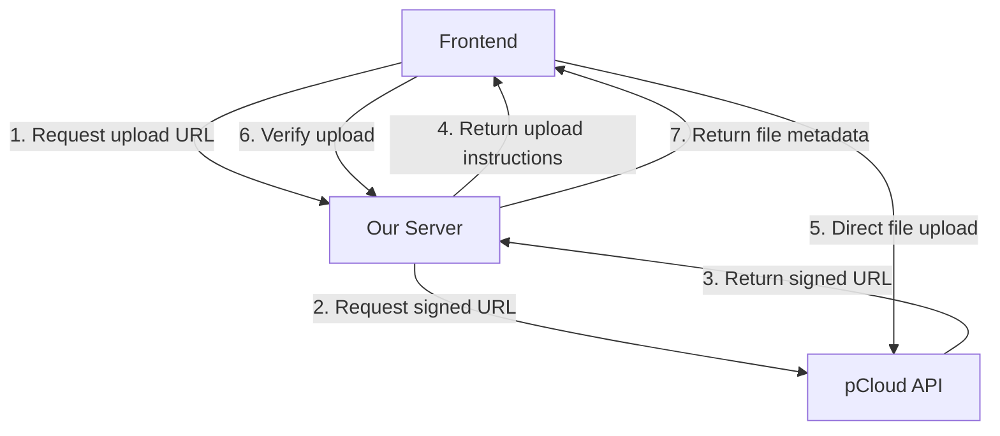

# Cloud-Agnostic File Upload Flow

## Overview

This implementation follows a **direct-to-cloud** upload pattern that:
- ✅ Avoids server memory issues with large files
- ✅ Maintains cloud-agnostic architecture
- ✅ Provides better performance and scalability
- ✅ Follows SOLID principles

## Upload Flow



## Step-by-Step Implementation

### 1. Frontend Requests Upload URL

```typescript
// Frontend: Request upload URL from our server
const { uploadUrl, method, headers, fileId } = await $fetch('/api/pcloud/files/upload-url', {
  method: 'POST',
  body: {
    folderId: 123,
    filename: 'document.pdf',
    contentType: 'application/pdf',
    size: file.size,
  }
})
```

### 2. Server Requests Signed URL from pCloud

```typescript
// Server: server/api/pcloud/files/upload-url.post.ts
const response = await $fetch<PCloudUploadUrlResponse>(pcloudUploadUrl, {
  method: 'POST',
  headers: { authorization: `Bearer ${token}` },
  params: {
    folderid: folderId,
    filename,
    contenttype: contentType,
    size,
    nopartial: 1
  }
})
```

### 3. Frontend Uploads Directly to pCloud

```typescript
// Frontend: Direct upload to pCloud (bypassing our server!)
const uploadResponse = await fetch(uploadUrl, {
  method: method || 'PUT',
  headers: {
    'Content-Type': file.type,
    ...headers,
  },
  body: file, // Raw file data - no server memory usage!
})

if (!uploadResponse.ok) {
  throw new Error('Direct upload failed')
}
```

### 4. Verify Upload (Optional)

```typescript
// Frontend: Verify upload by getting file metadata
const fileMetadata = await $fetch('/api/pcloud/files/{fileId}', {
  method: 'GET'
})
```

## API Endpoints

### POST `/api/pcloud/files/upload-url`

**Request Body:**
```json
{
  "folderId": 123,
  "filename": "document.pdf",
  "contentType": "application/pdf",
  "size": 1024000,
  "nopartial": true
}
```

**Response:**
```json
{
  "uploadUrl": "https://upload.pcloud.com/...",
  "method": "PUT",
  "headers": {
    "Authorization": "Bearer ..."
  },
  "expires": "2023-12-31T23:59:59Z",
  "fileId": 456
}
```

### GET `/api/pcloud/files/{fileId}`

**Response:**
```json
{
  "downloadUrl": "https://download.pcloud.com/...",
  "expires": "2023-12-31T23:59:59Z"
}
```

## Error Handling

The server maps pCloud error codes to appropriate HTTP status codes:

| pCloud Code | HTTP Status | Description |
|-------------|-------------|-------------|
| 1000, 2000 | 401 | Authentication required/failed |
| 2001 | 400 | Invalid filename |
| 2003 | 403 | Access denied |
| 2005 | 404 | Folder doesn't exist |
| 2008 | 402 | User over quota |
| 2041 | 503 | Connection broken |
| 4000 | 429 | Too many requests |
| 5000, 5001 | 500 | Internal error |
| 2004 | 409 | File already exists |

## Benefits

### ✅ Architecture
- **Cloud-Agnostic**: Frontend doesn't know it's talking to pCloud
- **SOLID Principles**: Single responsibility, open/closed, interface segregation
- **Clean Separation**: URL generation vs. file upload

### ✅ Performance
- **No Memory Issues**: Files never touch our server
- **Scalable**: Handles unlimited file sizes
- **Parallel Uploads**: Multiple files can upload simultaneously
- **Reduced Bandwidth**: Our server only handles metadata

### ✅ Reliability
- **Resilient**: Direct uploads continue even if our server restarts
- **Retryable**: Frontend can retry failed uploads
- **Progress Tracking**: Easy to implement upload progress

### ✅ Security
- **Signed URLs**: Temporary, scoped access
- **No File Processing**: Reduced attack surface
- **HTTPS**: All transfers encrypted

## Frontend Implementation Example

```typescript
// composables/useFileUpload.ts
import { ref } from 'vue'

export function useFileUpload() {
  const uploadProgress = ref(0)
  const isUploading = ref(false)
  const error = ref<string | null>(null)

  async function uploadFile(file: File, folderId: number) {
    try {
      isUploading.value = true
      uploadProgress.value = 0
      error.value = null

      // 1. Get signed URL
      const { uploadUrl, method, headers, fileId } = await $fetch('/api/pcloud/files/upload-url', {
        method: 'POST',
        body: {
          folderId,
          filename: file.name,
          contentType: file.type,
          size: file.size,
        }
      })

      // 2. Direct upload with progress tracking
      const response = await fetch(uploadUrl, {
        method: method || 'PUT',
        headers: {
          'Content-Type': file.type,
          ...headers,
        },
        body: file,
        onUploadProgress: (progressEvent) => {
          if (progressEvent.total) {
            uploadProgress.value = Math.round((progressEvent.loaded * 100) / progressEvent.total)
          }
        }
      })

      if (!response.ok) {
        throw new Error('Upload failed')
      }

      // 3. Verify upload
      const fileMetadata = await $fetch(`/api/pcloud/files/${fileId}`)
      return fileMetadata
    }
    catch (err) {
      error.value = err.message
      throw err
    }
    finally {
      isUploading.value = false
    }
  }

  return {
    uploadFile,
    uploadProgress,
    isUploading,
    error
  }
}
```

## Migration from Old Approach

If you were previously using the server-mediated upload:

**Before (❌ Memory issues):**
```typescript
// Old approach - file goes through our server
const formData = new FormData()
formData.append('file', file)
const result = await $fetch('/api/pcloud/files/upload', {
  method: 'POST',
  body: formData // ❌ File data sent to our server
})
```

**After (✅ Direct to cloud):**
```typescript
// New approach - file goes directly to pCloud
const { uploadUrl } = await $fetch('/api/pcloud/files/upload-url', {
  method: 'POST',
  body: { folderId, filename: file.name } // ✅ Only metadata
})

await fetch(uploadUrl, {
  method: 'PUT',
  body: file // ✅ File goes directly to pCloud
})
```

## Testing

To test the upload flow:

1. **Mock the upload URL endpoint** in your tests
2. **Verify the frontend** receives correct URL and headers
3. **Test error cases** (authentication, quota, invalid filenames)
4. **Test large files** to ensure no memory issues
5. **Test network interruptions** to verify retry logic

## Notes

- The `nopartial` parameter disables partial uploads for simplicity
- Upload URLs are temporary and expire (typically after 15-30 minutes)
- For very large files (>100MB), consider implementing chunked uploads
- Remember to handle CORS properly if testing locally
